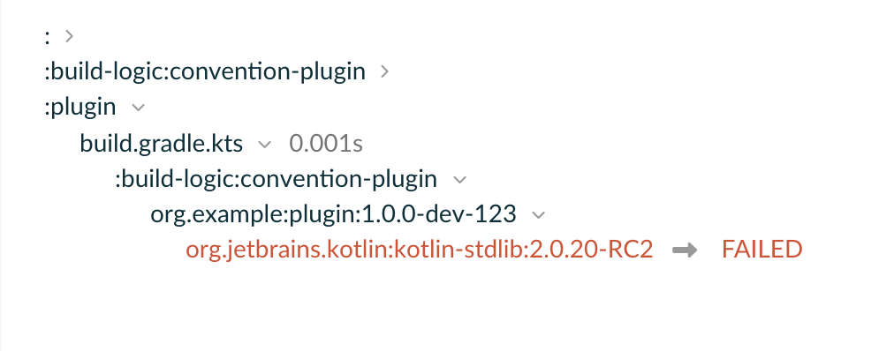
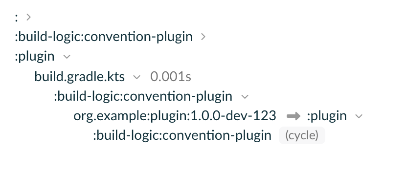

# Buildscript classpath substitution

## Steps to reproduce
1. Invoke `./gradlew publish -Pversion=1.0.0-dev-123` – it publishes the plugin to local repo directory
2. Invoke `./gradlew help -DapplyConventionPlugin=true -Pversion=1.0.0-dev-123` – it works fine.
3. Invoke `./gradlew help -DapplyConventionPlugin=true -Pversion=1.0.0-dev-1234` – it works fine.
4. Invoke `./gradlew help -DapplyConventionPlugin=true -Pversion=1.0.0` – it works fine.
5. Invoke `./gradlew help -DapplyConventionPlugin=true -Pversion=1.0.0-dev-12` – it fails with
```
A problem occurred configuring project ':plugin'.
> Could not resolve all artifacts for configuration ':plugin:classpath'.
   > Could not find org.jetbrains.kotlin:kotlin-stdlib:.
     Required by:
         project :plugin > project :build-logic:convention-plugin > org.example:plugin:1.0.0-dev-123

```
https://scans.gradle.com/s/hzbtc7phg5hme/build-dependencies?toggled=W1syXSxbMiwwXSxbMiwwLFs2OF1dLFsyLDAsWzY4LDY5XV1d


Note that in the successful case (e.g. from step 2) there's something strange in the buildscript classpath:
https://scans.gradle.com/s/74falrrzxzbvs/build-dependencies?toggled=W1syXSxbMiwwXSxbMiwwLFs2OF1dLFsyLDAsWzY4LDY5XV1d


The problem seems specific to kotlin-stdlib and kotlin-reflect.
For example, it does not happen with `org.jetbrains.kotlin:kotlin-build-tools-api:2.0.20-RC2` or `com.google.code.gson:gson:2.11.0`