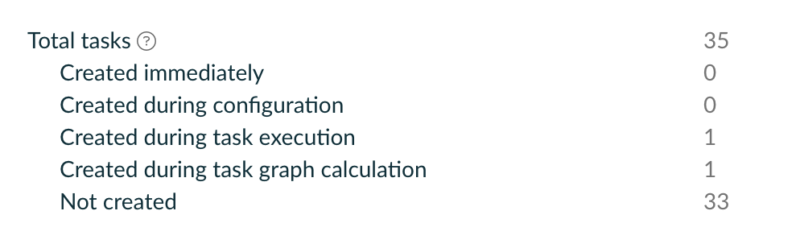

# Dependency resolution at execution time may cause task instantiation

1. Invoke `./gradlew :resolvingTask`
   You won't see anything suspicious in the output

2. Modify the `ConfigurablePublishArtifact` in [lib/build.gradle.kts](lib/build.gradle.kts) (lines 28-31)
   Specifically, remove configuration any of the properties. The strangest one is `classifier` as we're reconfiguring it from `null` to `null` and that helps. 

3. Invoke `./gradlew :resolvingTask`
   Now you'll see the line `:lib:task1 is instantiated` in build output at execution time.
   This can also be verified by checking the [build scan](https://scans.gradle.com/s/yws4inyubcnks/performance/configuration):
   

This is not observable on Gradle 8.4 and higher.